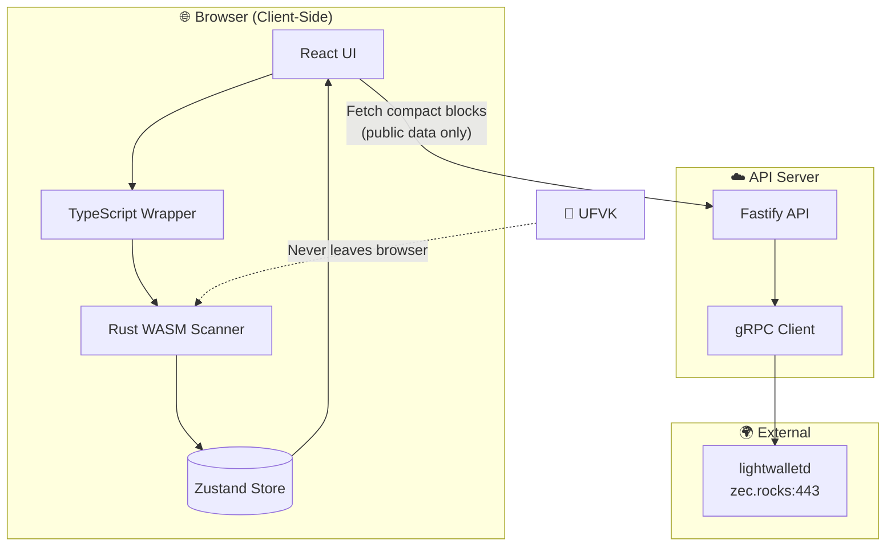
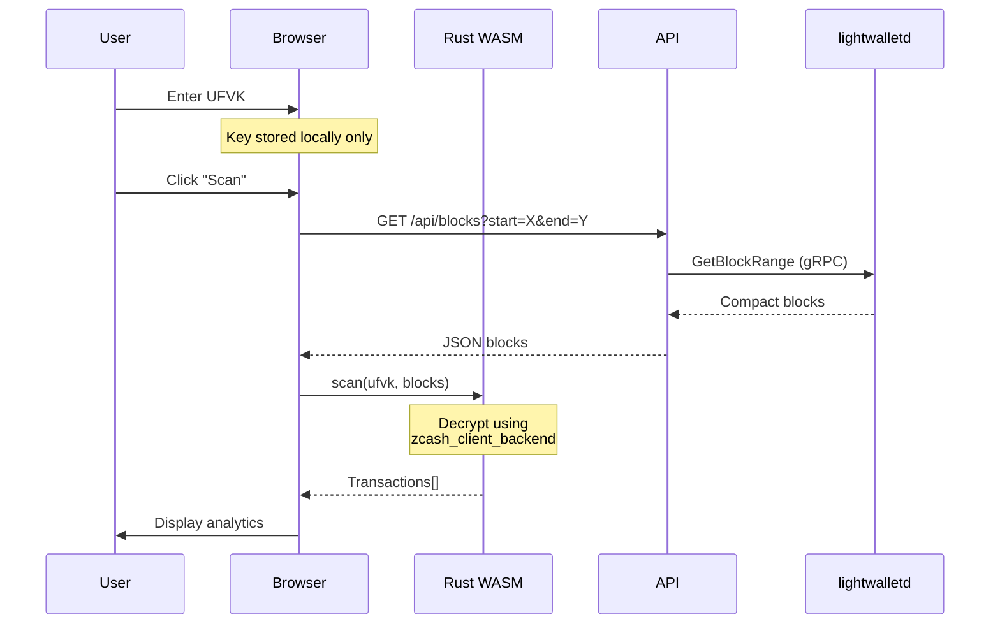

# 🔒 ZecScope

**Private Zcash Shielded Transaction Scanner**

> Your keys. Your data. Your browser. Nothing leaves your device.

---

## The Problem

Zcash shielded transactions are private by design — but this makes it impossible to audit your own transaction history using traditional block explorers. How do you analyze your finances without exposing your viewing key to a third party?

## The Solution

**ZecScope** runs official Zcash scanning logic directly in your browser using WebAssembly. Your viewing key never leaves your device — we only fetch public compact block data from the network.

---

## ✨ Key Features

- **🔑 Bring Your Own Key** — Import UFVKs from Zashi, Ywallet, or any modern wallet
- **🌿 Sapling + 🌸 Orchard** — Scan both shielded pools
- **📊 Multi-Key Analytics** — Combine multiple keys for organization-wide views
- **🔔 Smart Alerts** — Get notified on large or unusual transactions
- **� Export Reports** — One-click CSV download for accounting
- **🦀 Rust Crate** — Reusable `zecscope-scanner` library for developers

---

## 🏗️ Architecture



### Data Flow



### Privacy Guarantees

| What | Where | Exposed? |
|------|-------|----------|
| Viewing Key (UFVK) | Browser only | ❌ Never |
| Decrypted Transactions | Browser only | ❌ Never |
| Compact Blocks | Public network | ✅ Public data |
| Your IP Address | API server | ⚠️ Standard web |

---

## 🚀 Quick Start

```bash
# Clone & install
git clone https://github.com/yourusername/zecscope.git
cd zecscope && npm install

# Build WASM scanner
npm run build:wasm

# Start servers (2 terminals)
LIGHTWALLETD_ENDPOINT='zec.rocks:443' npm run dev:api
npm run dev:web
```

Open **http://localhost:5173** → Paste your UFVK → Scan!

---

## 🦀 Rust Crate

The core scanning logic is available as a standalone crate:

```toml
[dependencies]
zecscope-scanner = "0.1"
```

```rust
use zecscope_scanner::{Scanner, ScanRequest};

let scanner = Scanner::mainnet();
let txs = scanner.scan(&ScanRequest {
    viewing_key: "uview1...".into(),
    key_id: "wallet".into(),
    compact_blocks: blocks,
})?;

for tx in txs {
    println!("{} {} ZEC ({})", 
        if tx.direction == TxDirection::In { "+" } else { "-" },
        tx.amount_zec(), 
        tx.pool
    );
}
```

**Features:** `sapling` (default), `orchard` (default), `wasm`

---

## 📦 Project Structure

```
zecscope/
├── crates/zecscope-scanner/  # 🦀 Core Rust library (publishable)
├── zcash-wasm/               # WASM bindings for browser
├── web/                      # React frontend (Vite)
└── api/                      # Fastify + gRPC proxy
```

---

## 🛠️ Tech Stack

| Component | Technology |
|-----------|------------|
| Scanner | Rust, `zcash_client_backend`, `orchard` |
| WASM | `wasm-bindgen`, `wasm-pack` |
| Frontend | React 18, TypeScript, Vite, Zustand |
| Backend | Fastify, gRPC, TypeScript |
| Network | lightwalletd (zec.rocks) |

---

## 📄 License

MIT — See [LICENSE](LICENSE)

---

<p align="center">
  <strong>ZecScope</strong> — Private analytics for private money.
</p>
